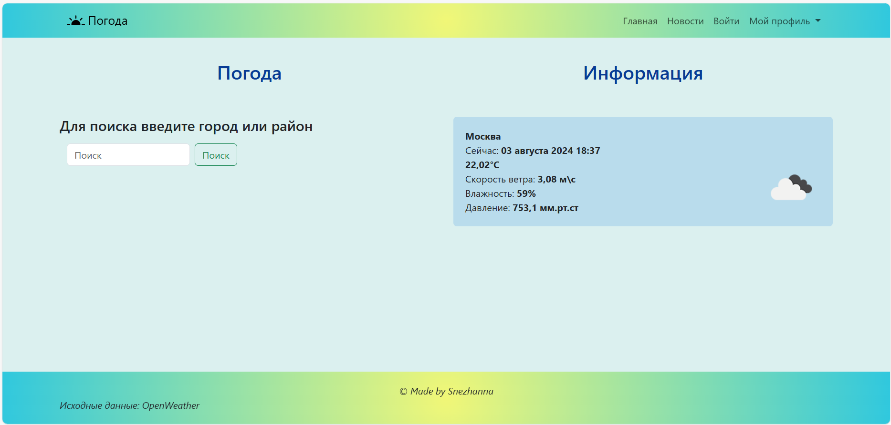
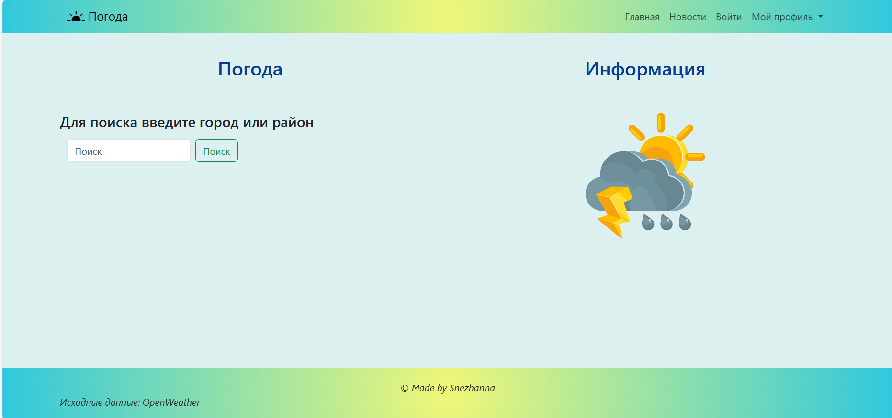

# Сайт погода
---
Этот проект сделан при помощи фреймворка Django. Так же с ипользованием API сайта OpenWeathermap.org
На сайте можно посмотреть погоду, почитать интересные статьи.
<div> 

</div>

***
#### Технологии:
- фреймворк Django
- система авторизации, аутентификации
- SQLite 

***

#### Требования:
Для того чтобы запустить проект вам нужно установить на компьютер [Python](www.python.org) (по установке можете почитать документацию) 

#### Как запустить проект
Сначала нам нужно получить API ключ. Для этого переходим на сайт [OpenWeather](openweathermap.org), регистрируемся. В разделе API находим свой ключ, копируем.

Переходим в проект, в приложении **weathersite** создаем файл **apikey.py**
Туда записываем **API_TOKEN = "ваш ключ"**
Открываем терминал пишем

```
python manage.py runserver
```
или
```
python3 manage.py runserver
```

далее переходим по ссылке которая появиться или набираем в браузере http://127.0.0.1:8000/
Готово, можете тестировать сайт

---

<div>
Для связи со мной
 @ss_snegg
</div>